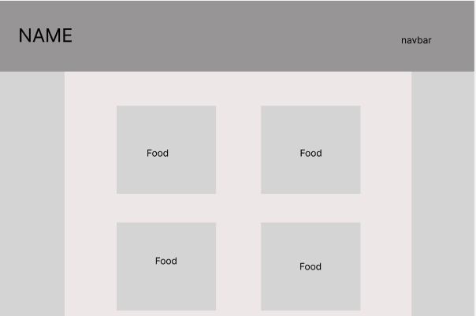
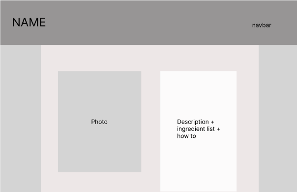

# FavorEats #
A full CRUD application 

[Check out CRUD app here](https://favoreats.up.railway.app/eat)

## Screenshot of the App
# 

## List of the Technologies used
- visual studio code text editor
- MangoDB, Mongoose, express, ejs, Railway, MangoAtlas
- languages: css, html, js

## Seed Data Original Sources
- [Natashas Kitchen](https://natashaskitchen.com/beef-and-broccoli/)
- [Ready Set Eat](https://www.readyseteat.com/recipes-Chicken-Burrito-Skillet-7722)
- [Food Network](https://www.foodnetwork.com/recipes/rachael-ray/barbecued-chinese-chicken-lettuce-wraps-recipe-1915308)

## Installation instructions
- no installations necessary

## Your User stories:
- As someone who likes to cook for themselves, and rather than having to look through many bookmarks, I'd like to keep track of my new and old recipes on one source.
- As a working parent I don't have much time to be looking around for ideas of what to cook tonight, it'd be nice to have a place that has my favorited recipes as well as new ones.
- As a chef I'm always looking to be inspired by others recipes and finding new and innovative ideas.

## Wireframes: 
# 
# 
# 

## Unsolved problems:
- styling isn't to satisfaction
- username has no utility
